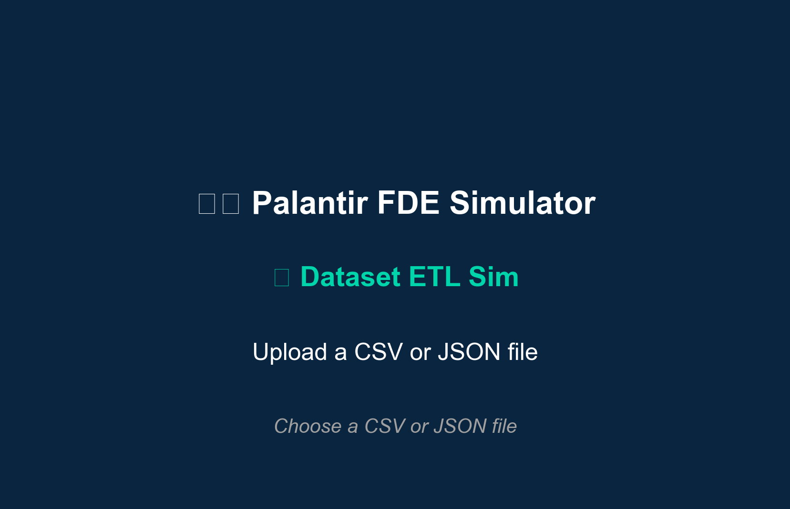
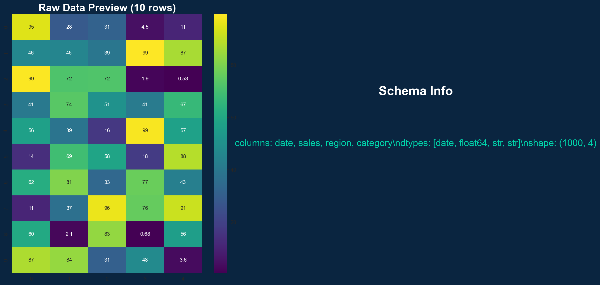
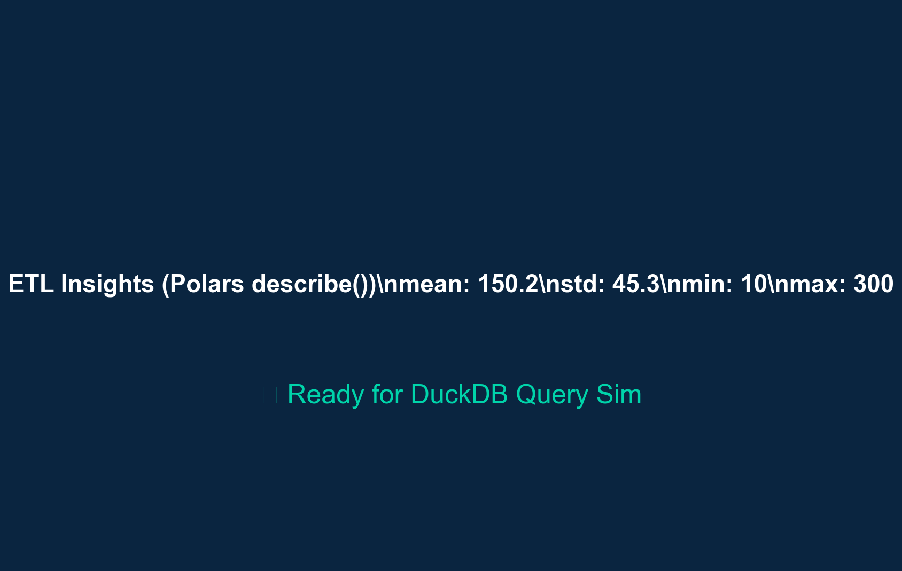
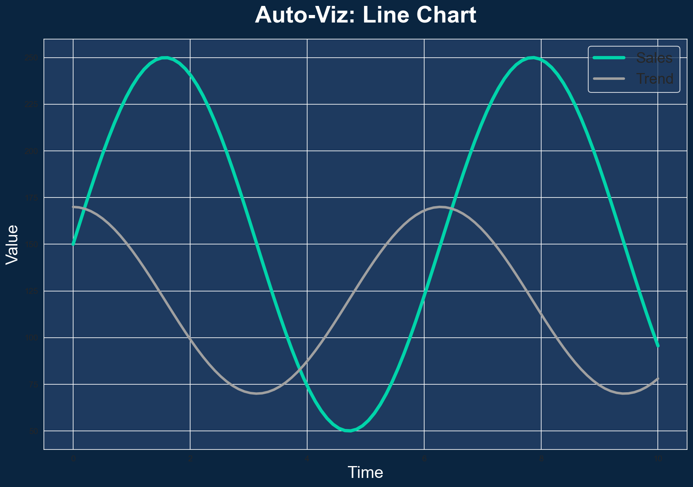
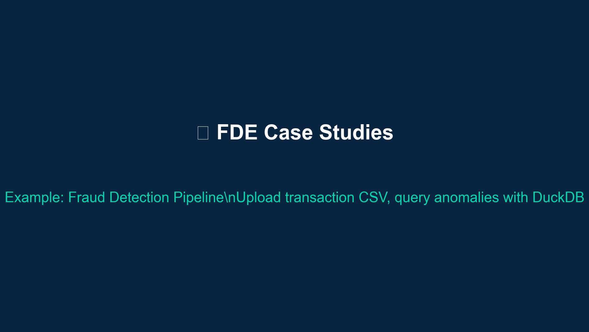
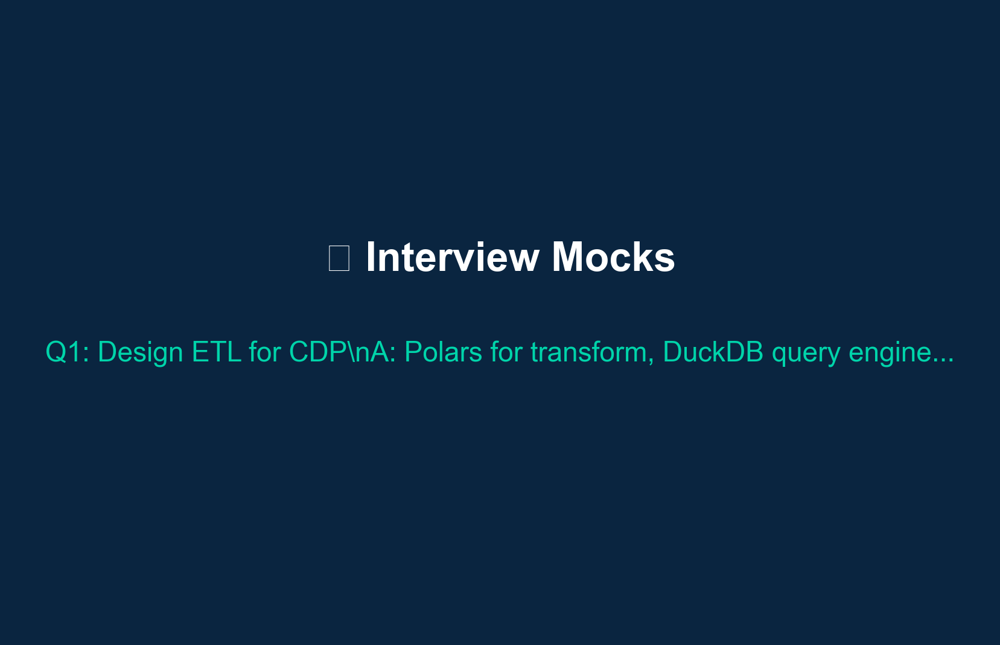

# Palantir FDE Simulator v0.1 MVP\n\nDataset upload → ETL/deploy sim (DuckDB/Polars), case studies, interview mocks.\n\n## Stack\n- Streamlit + Gradio UI\n- Supabase DB (auth/data)\n- Vercel deploy\n\nLive demo: http://localhost:8501

## Marketing

## Screenshots

